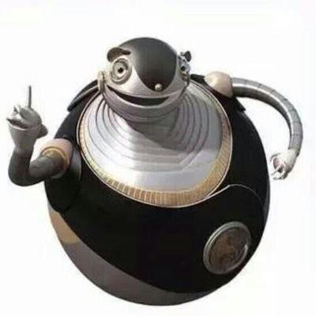
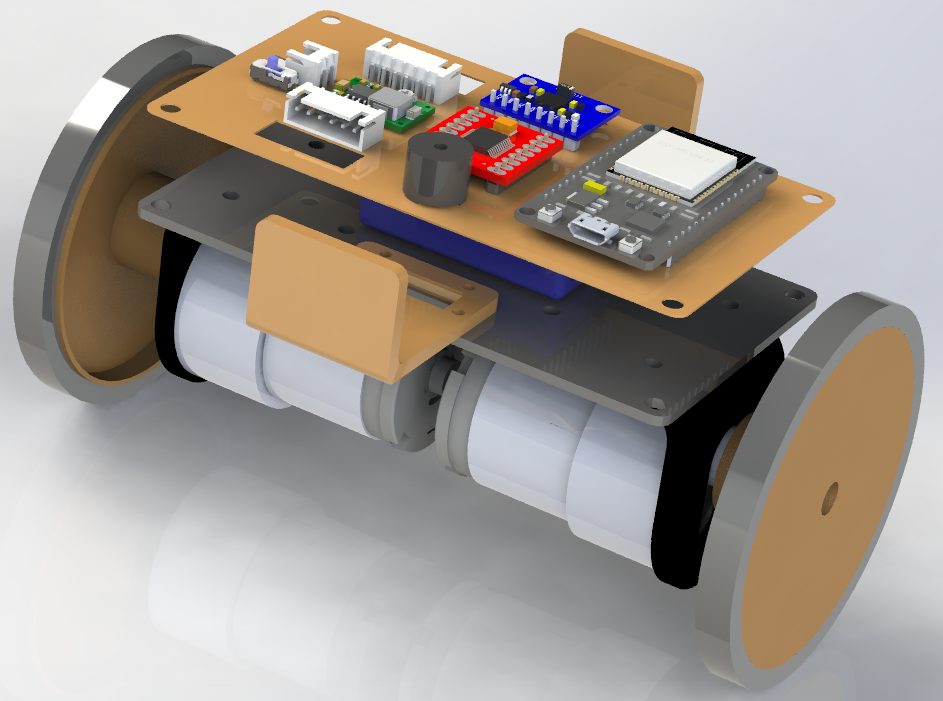

<h1> Self Balancing Robot </h1>

 
    This is a self balancing robot made with esp32, that is, a robot with 2 wheels that will have to balance itself.  

<h2>  🔗 Summary </h2>

<h2> 🗼 Bigweld </h2>

<h3>  🛠️ Bill of materials </h3>

<h2> 🎱 Cannonbolt </h2>

<h3>  🛠️ Bill of materials </h3>

<h2>  ✔️ Techniques and technologies </h2>

- ``Arduino``
- ``ESP32``
- ``C``
- ``C++``
- ``POO``
- ``PID controller``
- ``Motors``
- ``Sensors``
